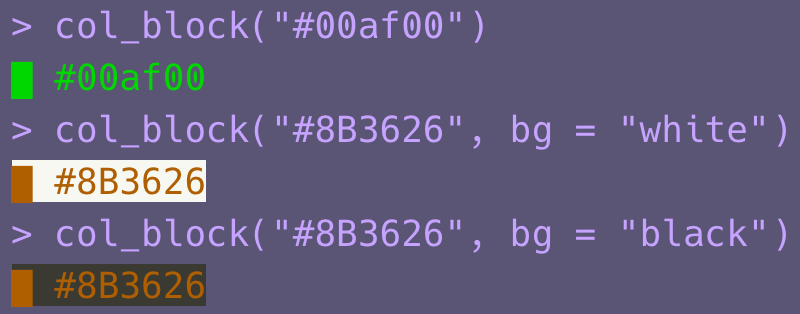

<!-- README.md is generated from README.Rmd. Please edit that file -->

```{r, include = FALSE}
knitr::opts_chunk$set(
  collapse = TRUE,
  comment = "#>",
  fig.path = "man/figures/README-",
  out.width = "100%"
)
```

# colorinfo

<!-- badges: start -->
<!-- badges: end -->

The goal of colorinfo is to ...

## Installation

You can install the released version of colorinfo from GitHub with:

``` r
if (!requireNamespace("remotes"))
  install.packages("remotes")

remotes::install_github("uribo/colorinfo")
```

## Example

This is a basic example which shows you how to solve a common problem:

```{r example}
library(colorinfo)
```

```{r, eval=FALSE, echo=FALSE}
col_block("#00af00")

col_block("#8B3626", bg = "white")
col_block("#8B3626", bg = "black")
```


