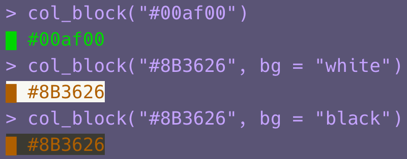

<!-- README.md is generated from README.Rmd. Please edit that file -->

# colorinfo

<!-- badges: start -->
<!-- badges: end -->

The goal of colorinfo is to …

## Installation

You can install the released version of colorinfo from GitHub with:

``` r
if (!requireNamespace("remotes"))
  install.packages("remotes")

remotes::install_github("uribo/colorinfo")
```

## Example

This is a basic example which shows you how to solve a common problem:

``` r
library(colorinfo)
```


